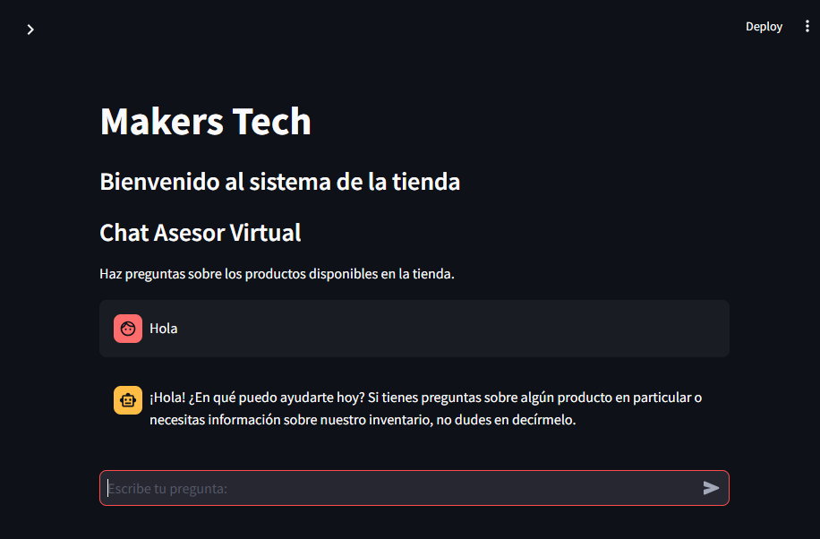

# 🤖 Makers Tech - Chatbot para tus compras

👋 ¡Bienvenid@ al sistema de inventario y recomendaciones de Makers Tech! Este proyecto es un chatbot interactivo desarrollado con Streamlit y OpenAI que permite a los usuarios explorar productos tecnológicos, recibir recomendaciones personalizadas y gestionar métricas de inventario de manera eficiente.



## 1️⃣ Características principales
- **Recomendaciones personalizadas**: Basadas en tus intereses, rango de precios y características específicas.
- **Gestión de inventario**: Métricas visuales y análisis de productos con bajo stock.
- **Interfaz amigable**: Diseñada tanto para clientes como administradores.

## 💻 Requisitos del sistema
Antes de empezar, asegúrate de que tienes lo siguiente:
- Python 3.8 o superior
- pip (administrador de paquetes de Python)

## 🐍 Instalación
Sigue estos pasos para ejecutar el proyecto en tu computadora:

1. Clona este repositorio:

    ```bash
    git clone https://github.com/joelesdar/Chatbot-Makers-Tech.git
    cd Chatbot-Makers-Tech
    ```

2. Crea un entorno virtual (opcional pero recomendado):

    ```bash
    python -m venv venv
    source venv/bin/activate    # En macOS/Linux
    venv\Scripts\activate       # En Windows
    ```

3. Instala las dependencias: Ejecuta el siguiente comando para instalar los paquetes requeridos:

    ```bash
    pip install -r requirements.txt
    ```

4. Configura tu clave API de OpenAI: Crea un archivo llamado `.env` en el directorio raíz del proyecto y agrega tu clave API de OpenAI:

    ```plaintext
    API_KEY=tu_api_key
    ```

5. Ejecuta la aplicación: Inicia el servidor Streamlit con el siguiente comando:

    ```bash
    streamlit run main.py
    ```

6. Abre la aplicación: Una vez iniciado, tu navegador abrirá automáticamente la dirección `http://localhost:8501`. ¡Disfruta de la experiencia!

## 🏗️ Estructura del proyecto

```plaintext
makers-tech/
├── main.py                  # Código principal de la aplicación Streamlit
├── requirements.txt         # Dependencias necesarias
├── inventario_makers_tech.csv # Base de datos del inventario
├── .env                     # Archivo para la clave API de OpenAI (no incluido en el repositorio)
├── README.md                # Documentación del proyecto
```

## ⌨️ Versión web
👉 [Chequea el proyecto aquí!](https://chatbot-makers-tech-tbqhrykqfk5ytznxuadxfc.streamlit.app/)
